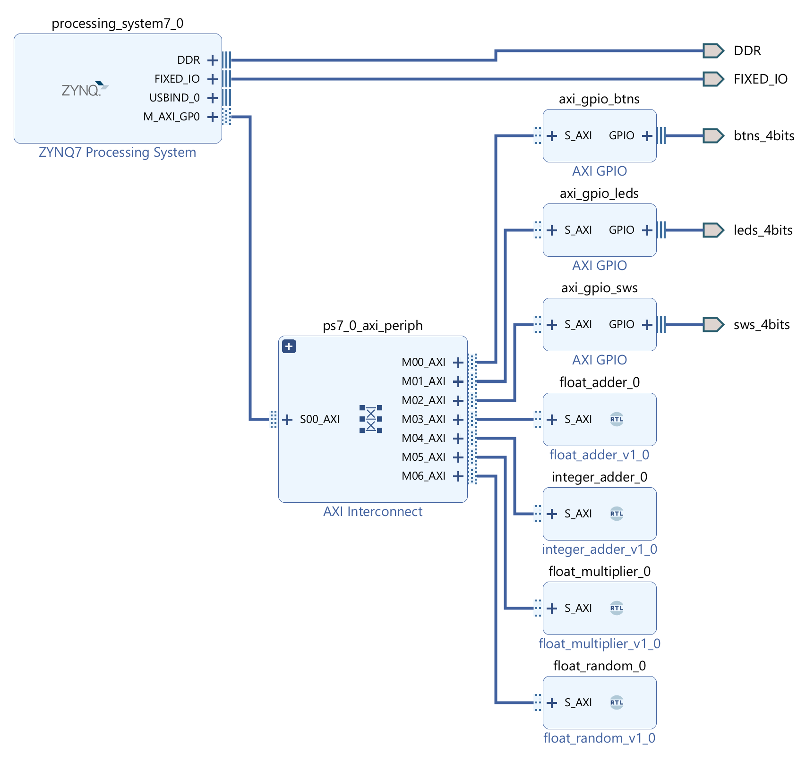
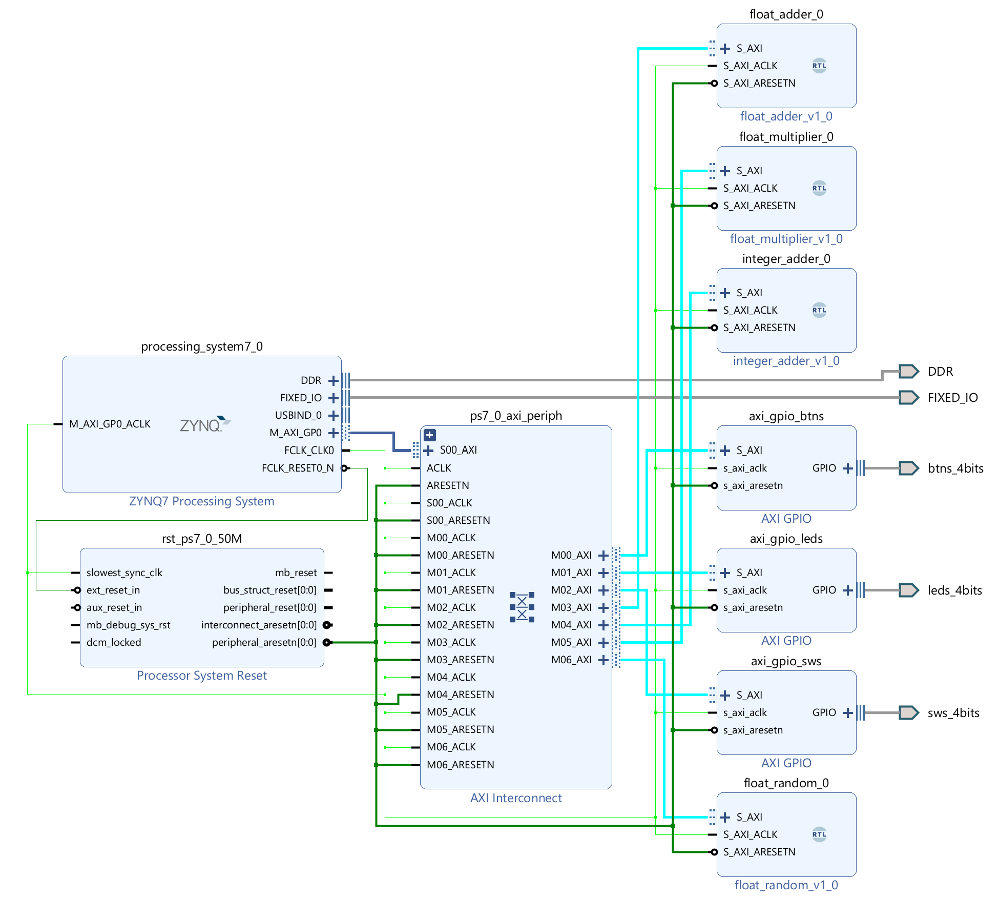
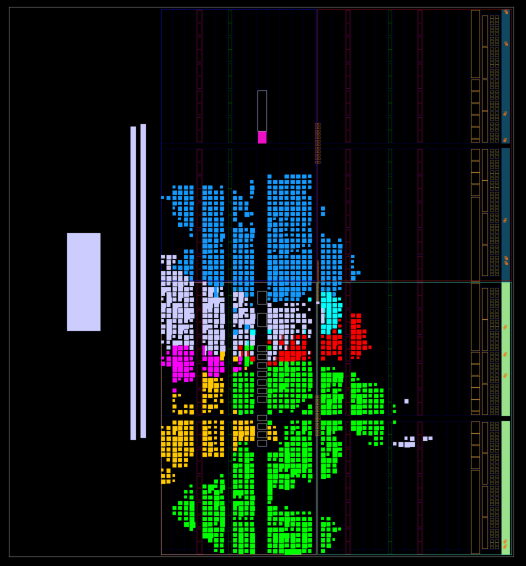
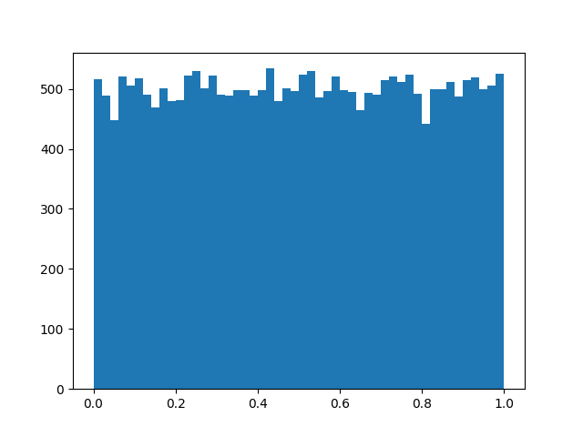

<!-- --------------------------------------------------------------------------------- -->
<!--  Distributed under MIT Licence -->
<!--    See https://github.com/josephabbey/z7-coprocessor/blob/main/LICENCE. -->
<!-- --------------------------------------------------------------------------------- -->

# Z7-Coprocessor

A coprocessor for the Zybo Z7-10 board, providing functionality for floating point operations.

## Architecture

The Architecture is simple. The PS is connected to the PL via the AXI bus. All of the *modules* are a separate AXI MM slave, which is connected to the AXI bus. The PS can access the modules via the AXI bus, by using *magic memory addresses* (any address on the bus is equivalent to the same address in memory).

## Floating Point Implementations

Compliant with the IEEE 754 standard, single precision (32-bit) floating point numbers.

$$
a = (-1)^{s} \times (1 + m) \times 2^{e - 127}
$$

$$
s + eeeeeee + mmmmmmmmmmmmmmmmmmmmmmm
$$

### Adder

*This is my own design and implementation, this is not standard and not the most efficient.*

$$
a_m \times 2^{a_e} + b_m \times 2^{b_e} = (a_m + \frac{b_m}{2^{a_e - b_e}}) \times 2^{a_e}
$$

1. Decide the exponent, as we want to maintain accuracy, we use the larger exponent and drop the least significant bits, not the most significant bits.

2. Shift the mantissa of the smaller number to the right, so that it is aligned with the larger number.

3. Add the mantissas together using signed arithmetic. NB: Add the implicit leading 1 to the mantissas and convert to signed as necessary.

4. Normalize the result, if the mantissa is larger than 1, shift it to the right and increment the exponent (the mantissa can only ever have a 1 bit overflow as we are adding two numbers). Look for the first 1 in the mantissa and shift it to the front, update the exponent accordingly. If you don't find any ones, output 0. NB: All the previous steps used a larger data type, so we don't have to worry about overflow.

Special cases:

- If either number is NaN, return NaN.
- If either number is infinity, return infinity.

### Unary Minus

Just flip the sign bit.

### Subtracter

Use the adder but flip the sign bit of the second number. This is equivalent to adding the first number and the negation of the second number.

### Multiplier

*This is my own design and implementation, this is not standard and not the most efficient.*

$$
a_m \times 2^{a_e} \times b_m \times 2^{b_e} = a_m \times b_m \times 2^{a_e} \times 2^{b_e} = (a_m \times b_m) \times 2^{a_e + b_e}
$$

1. Add the exponents together, use unsigned arithmetic and subtract 127, due to the bias in the exponent representation.
2. Multiply the mantissas together using long multiplication. NB: Add the implicit leading 1 to the mantissas.
3. The resulting mantissa will either have one bit overflow, or already be normalised. If it has overflowed, shift the mantissa to the right and increment the exponent.
4. THe resulting sign is the XOR of the two signs.

Special cases:
- If either number is NaN, return NaN.
- If either number is infinity, return infinity.
- If either number is zero, return zero.

### Random Number Generator

A simple linear feedback shift register (LFSR) based random number generator.

Inspired by [scrartch_vhdl](https://house-of-abbey.github.io/scratch_vhdl/lfsr.html).

Using a 28-bit LFSR with the polynomial $x^{28} + x^{25} + 1$ (prime polynomial from [University of Otago](https://www.physics.otago.ac.nz/reports/electronics/ETR2012-1.pdf)). So that is pretty random.

The LFSR is instantiated 23 times, each piped into the next, to give a set of 23 random bits each clock cycle.

Those 23 bits as the mantissa, an exponent of "01111111" (which is 127 in decimal, but 0 with the bias), and a sign bit of 0 (positive) for a number between 1 and 2.

Subtract 1 to get a number between 0 and 1.

The random number is quite uniform, but not perfectly random. The distribution is shown below.

NB: This will never return 0, NaN, or infinity.
